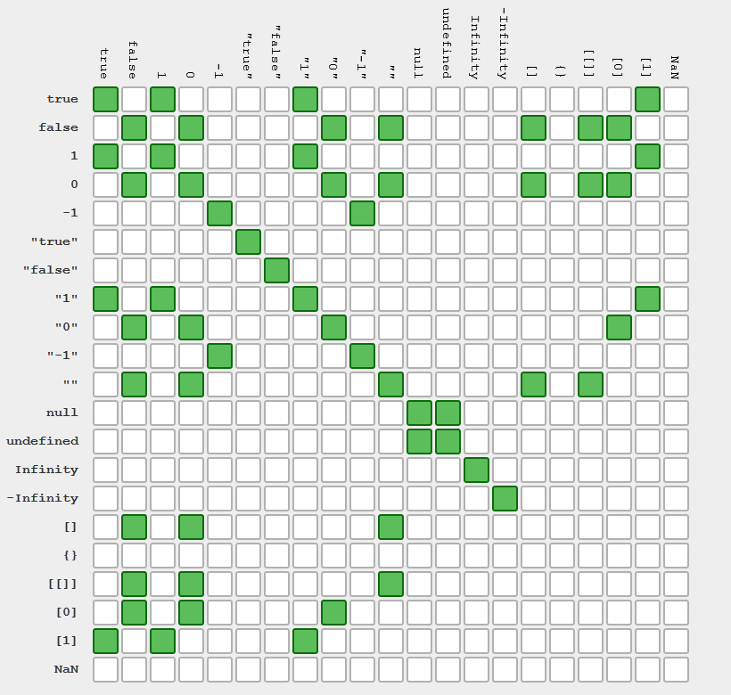

# Setup

* Available for SunOS, Linux, Mac OS X, and Windows 32/64 bit
* `node -v`, `npm -v`

```javascript
console.log('Hello, World!');
```

`node main.js`

# Basics

## Types

### Primitives
* Boolean
* Number
* String
* undefined
* null

### Non-Primitives
* Object
* Regex
* Function
* Array
* Date

## Comparison



## Declaration

```javascript
const bar = 'bar';
let foo = 'foo';

foo = foo || 'default';
```

## Scope - Constructor-Function

```javascript
function MyObj () {
  this.foo = 'foo'
}

const myObj = new MyObj();
```

## Scope - Bind / Call / Apply

```javascript
function myFunc () {
  console.log(arguments);
  console.log(this.execAs);
}

console.log(myFunc.call({execAs: 'call'}, 'a', 'b'));
console.log(myFunc.apply({execAs: 'apply'}, ['a', 'b']));

const myFuncBind = myFunc.bind({execAs: 'bind'});
console.log(myFuncBind('a', 'b'));
```

