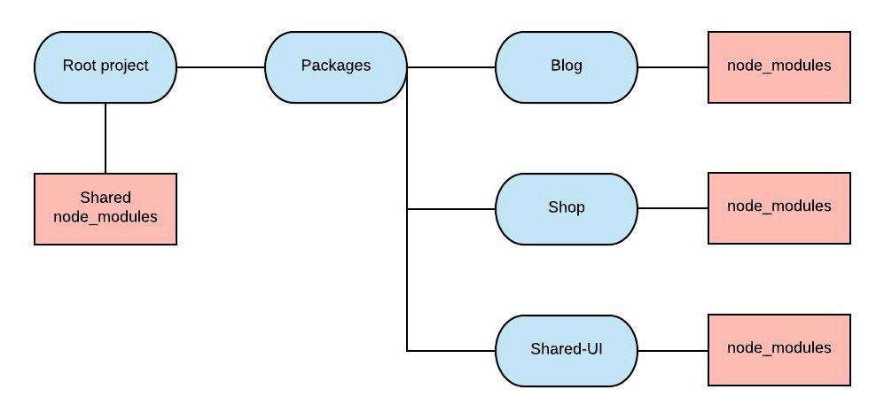

# NPM & Yarn

- [NPM](#npm)
  - [Global vs. Local](#global-vs-local)
  - [`package.json`](#package.json)
  - [Outdated / Update versions](#update-versions)
- [Yarn](#yarn)
  - [Upgrade versions](#upgrade)
  - [Workspaces and Monorepo](#workspaces-and-monorepo)

## NPM

### Global vs. Local

```bash
sudo npm install npm -g
```

```bash
npm install lodash
```

### `package.json`

```bash
npm init
```

### Update versions

#### Outdated versions

```bash
npm outdated
```

#### Update version

```bash
npm update
```

### Publish to Repository

```bash
npm adduser
npm publish
```

### Ignore files

- add `.npmignore`

## Yarn

- the "new" JS Package Manager
- Backward compatible
- `yarn install`
- `yarn add ...`

### Upgrade

```bash
yarn upgrade-interactive --latest
```

### Workspaces and Monorepo



1. Create a `packages` folder in root
2. Copy your projects into the `packages` folder
3. Add a `packages.json` into your root

```json
{
  "private": true,
  "workspaces": ["packages/*"]
}
```
