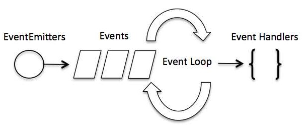

# Event-Loop Architecture



- observer pattern (similar to callbacks)
- asynchronous function (handler) returns its result
- EventEmitter-Module

```javascript
// Import events module
const EventEmitter = require('events');

// Create an eventEmitter object
const eventEmitter = new EventEmitter();

// Bind event and even handler as follows
eventEmitter.on('eventName', message => {
  console.log(message);
});

// Fire an event
eventEmitter.emit('eventName', { value: '1' });
```
